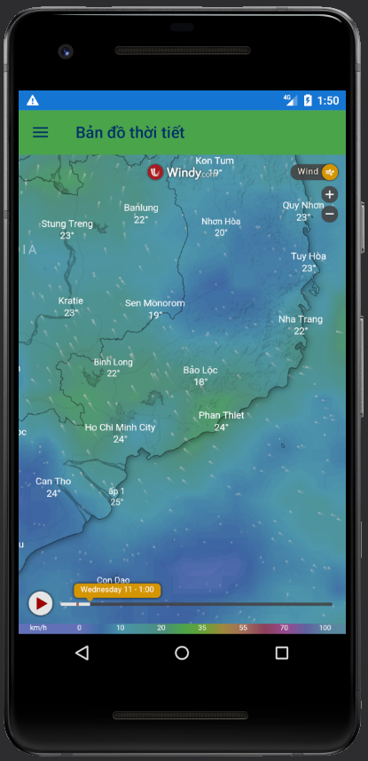

# App Weather SunJ

<a href="https://youtu.be/9FFDX6xa830" style="font-size: 1.5rem">Video demo here 🔥</a>

<h2>Login Page</h2>
<!--  -->

<h2>Signup Page</h2>
<!--  -->

<h2>Forget Password Page</h2>
<!--  -->

<h2>Home Page</h2>
<!--  -->

<h2>Enter Location Page</h2>
<!--  -->

<h2>Information Page</h2>
<!--  -->

<h2>Save Location Page</h2>
<!--  -->

<h2>Add Location Page</h2>
<!--  -->

<h2>Map Page</h2>
<!--  -->

<h2>Account Page</h2>
<!--  -->

